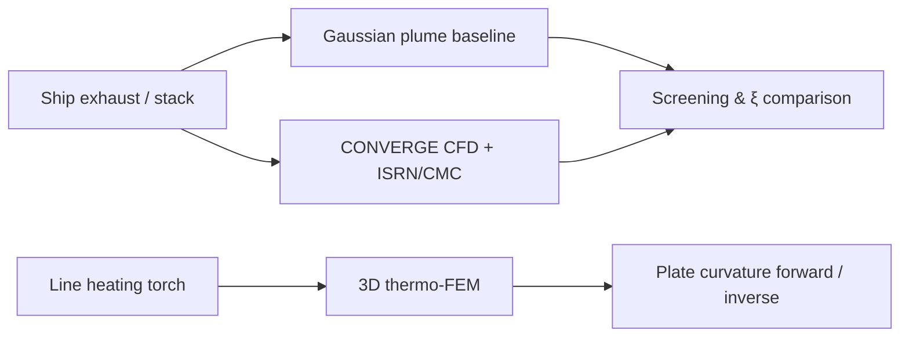

# Hi, I'm Ramesh Kolluru 👋

**Computational Fluid Dynamics · Numerical Methods · HPC (CUDA / Metal)**

Senior CFD consultant at [**BosonQ Psi (BQP)**](https://www.linkedin.com/company/bosonq-psi), based in **Sagar, Madhya Pradesh**. I develop advanced flow solvers, hybrid optimization frameworks, and GPU-accelerated PDE codes—with research spanning immersed-boundary methods, pollutant dispersion, hypersonics, and quantum-enhanced simulation approaches.

---

## About me

Computational fluid dynamics scientist with **20+ years** of experience across consulting, R&D, and teaching in **India, France, and Singapore**, including doctoral research at **IISc Bengaluru** and postdoctoral work on hybrid CFD–optimization frameworks.

- 🔭 **Current focus:** viscous flows, immersed-boundary methods, GPU Poisson/CFD solvers, and quantum-enhanced numerics (CVQLS, QAPINN)
- 🧮 **Methods:** GMRES, finite-volume / finite-difference schemes, CMC & ISRN for turbulent reacting flows, MPI-parallel CFD
- 🏢 **BQP** — quantum-powered physics simulation & optimization ([BosonQ Psi](https://www.linkedin.com/company/bosonq-psi))
- 🎓 **Background:** Cambridge CARES (Research Fellow) · IISc (Postdoc) · B.M.S. College of Engineering (Faculty) · IIT Madras (Research Scholar)

---

## Focus areas

| Area | Topics |
|------|--------|
| **CFD & HPC** | Immersed boundary methods, CUDA / Metal kernels, Poisson & Laplace solvers, OpenFOAM |
| **Marine & environmental** | Ship line heating, exhaust dispersion (ISRN/CMC), Gaussian plume baselines, naval architecture & propulsion |
| **Optimization** | Hybrid gradient / metaheuristic solvers coupled with in-house CFD (scramjet inlet design, etc.) |
| **Teaching** | *Python for Marine Engineering* — 2-semester LaTeX course (2026): numerics, pandas, marine KPIs, propulsion & condition monitoring |
| **Numerical methods** | GMRES, spectral & orthogonal basis functions, tensor-train linear algebra |

---

## Marine & ship modeling

### 🔥 Ship line heating (3D thermo-mechanics)

Coupled **transient heat transfer + thermoelasticity** workflow for **ship-plate line heating** and permanent bending:

- **Forward problem:** prescribed torch temperature (e.g. 900 K) → predicted curvature profile
- **Inverse problem:** target curvature + plate geometry → optimal heating pattern
- **Numerics:** Gmsh tetrahedral mesh (refined along heating lines), moving Gaussian surface heat flux, convection/radiation, 3D linear thermoelasticity (`thermo_bindings`), optional **inherent-strain** surrogate for residual bend
- **Outputs:** VTK (ParaView), plots, LaTeX/PDF reports; optional PINN paths (DeepXDE / Modulus)

### 🚢 Ship pollution — ISRN & CMC

**In-Situ Reaction Network (ISRN)** with **Conditional Moment Closure (CMC)** for ship-exhaust and atmospheric reacting flows, integrated with [**CONVERGE**](https://convergecfd.com/) CFD:

- Fortran production library + **C++ port** (Eigen, MPI, HDF5 restart) and unified Doxygen docs
- Resolves **micromixing** and fast chemistry (e.g. **NO, NO₂, SO₄**) behind large marine sources—beyond mean-field assumptions
- Application context: pollutant dispersion in the wake of a **~270 m oil tanker** (Cambridge CARES); CONVERGE UDF workflow for plume analysis with RANS/LES and detailed chemistry

### 🌫️ Gaussian plume modeling

Atmospheric **Gaussian plume** dispersion software used as a **regulatory / screening baseline** and for **manuscript comparison** against high-fidelity models:

- Reflected-ground point source: Pasquill–Gifford & **Briggs** σ models (class D stability)
- Computes mass concentration **C** [kg/m³] and passive scalar **ξ = C/ρ_source** for direct comparison with CFD/CMC/ISRN fields
- Python CLI + Tkinter GUI: contours, crosswind/vertical profiles, skewed-wind receptors, literature benchmark cases
- Validates when classical plume theory is sufficient vs. when **CMC/ISRN micromixing** and 3D CFD are required

---

## Tech stack

  
  
  
  
  
  
  
  
  
  

---

## Featured repositories

| Project | Description | Stack |
|--------|-------------|-------|
| [**IBM_Viscous**](https://github.com/rameshkolluru43/IBM_Viscous) | Immersed-boundary method for viscous flows | C++ |
| [**CFD_Solver_withCUDA**](https://github.com/rameshkolluru43/CFD_Solver_withCUDA) | CFD solver with CUDA kernels | CUDA |
| [**Poisson_Metal_CUDA**](https://github.com/rameshkolluru43/Poisson_Metal_CUDA) | Laplace / Poisson solvers on Metal and CUDA | C++ |
| [**GMRES_Python**](https://github.com/rameshkolluru43/GMRES_Python) | GMRES iterative solver experiments | Python |
| [**BQP_Drive**](https://github.com/rameshkolluru43/BQP_Drive) | BQP project resources & shared work | — |

---

## GitHub stats

  
  

  

---

## What I'm exploring

- 🌱 GPU porting and kernel tuning (CUDA ↔ Metal)
- 🔬 Quantum-enhanced CFD workflows at BQP
- 👯 Collaborations on **ship line heating**, **ISRN/CMC ship pollution**, **Gaussian plume baselines**, and **marine propulsion**
- 💬 Happy to discuss **line-heating FEM**, **CMC/ISRN**, **CONVERGE UDFs**, **Poisson solvers**, **GMRES**, and **HPC profiling**

---

## Connect

  
  
  
  
  

📫 **rameshkolluru43@gmail.com** · [LinkedIn](https://www.linkedin.com/in/drrameshkolluru) · [Google Scholar](https://scholar.google.co.in/citations?user=Zzl8hbwAAAAJ&hl=en) · [ORCID 0000-0001-5447-8550](https://orcid.org/0000-0001-5447-8550)

---

  

